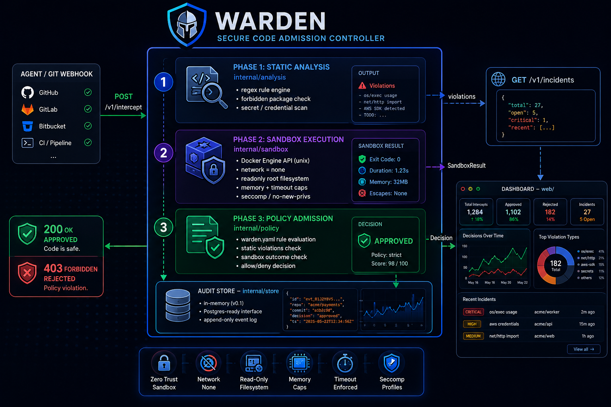
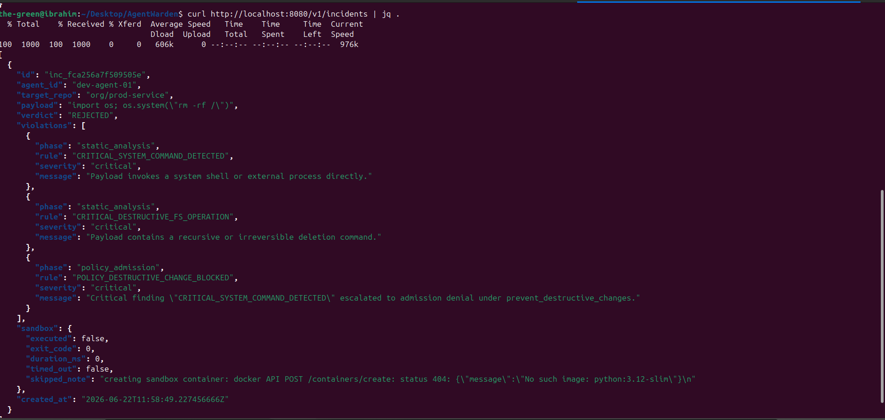
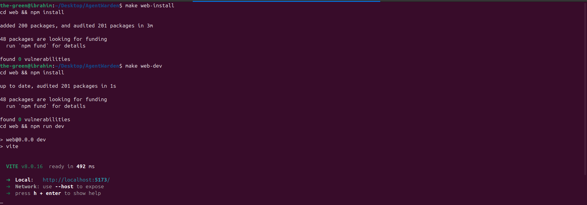

<div align="center">
  <h1>🛡️ AgentWarden</h1>
  <p><strong>The GitOps Guardrail & Secure Sandbox for Autonomous AI Agents</strong></p>

  [](LICENSE)
  [](https://github.com/ibrahimelothmani/AgentWarden/stargazers)
  [](https://hub.docker.com/r/ibrahimelothmani98/agentwarden)
</div>

---

## 💡 What is AgentWarden?

As AI agents move from writing simple scripts to autonomously committing code, refactoring microservices, and spinning up cloud infrastructure, they introduce massive security risks. Traditional CI/CD setups are built for predictable human input, not non-deterministic AI behavior.

**AgentWarden** is a developer-first, open-source admission controller designed specifically for AI-driven development pipelines. It acts as a secure, deterministic boundary between your AI agents (built on LangChain, CrewAI, n8n, or custom codebases) and your live repositories.

---

## Architecture



### Demo

<video src="docs/rcording.webm" controls width="800"></video>

---

## Quickstart

### Go (no Docker required for the server itself)

```bash
git clone https://github.com/ibrahimelothmani/AgentWarden.git
cd AgentWarden
go run ./cmd/agentwarden
```

The server starts on `:8080`. With no `warden.yaml` present it uses secure
defaults (network ingress denied, destructive changes blocked).

### Docker Compose (recommended — enables sandbox execution)

```bash
docker compose up --build
```

This mounts `/var/run/docker.sock` so AgentWarden can spin up sandbox
containers for Phase 2. If the socket isn't available, it falls back to
Phase 1 + Phase 3 only with a warning log.

---

## Try it

```bash
# Check server health
curl http://localhost:8080/healthz
# → {"status":"ok"}

# Submit a dangerous payload
curl -s -X POST http://localhost:8080/v1/intercept \
  -H "Content-Type: application/json" \
  -d '{
    "agent_id":    "dev-agent-01",
    "target_repo": "org/prod-service",
    "payload":     "import os; os.system(\"rm -rf /\")"
  }' | jq .
```

```json
{
  "status": "REJECTED",
  "policy_violation": "CRITICAL_SYSTEM_COMMAND_DETECTED",
  "violations": [
    {
      "phase": "static_analysis",
      "rule": "CRITICAL_SYSTEM_COMMAND_DETECTED",
      "severity": "critical",
      "message": "Payload invokes a system shell or external process directly."
    },
    {
      "phase": "static_analysis",
      "rule": "CRITICAL_DESTRUCTIVE_FS_OPERATION",
      "severity": "critical",
      "message": "Payload contains a recursive or irreversible deletion command."
    },
    {
      "phase": "policy_admission",
      "rule": "POLICY_DESTRUCTIVE_CHANGE_BLOCKED",
      "severity": "critical",
      "message": "Critical finding \"CRITICAL_SYSTEM_COMMAND_DETECTED\" escalated to admission denial under prevent_destructive_changes."
    }
  ],
  "action_taken": "PR creation blocked. Incident logged.",
  "incident_id": "inc_91ef0078f5fdc8a7"
}
```


```bash
# View incident history
curl http://localhost:8080/v1/incidents | jq .

# Fetch a single incident
curl http://localhost:8080/v1/incidents/inc_91ef0078f5fdc8a7 | jq .
```



---

## Dashboard

```bash
cd web && npm install && npm run dev
# → http://localhost:5173
```

The dashboard polls `GET /v1/incidents` every 5 seconds and shows verdict
badges, violation chips, and a per-incident detail view.



---

## Configuration — warden.yaml

```yaml
version: "1.0"
policies:
  security:
    allow_network_ingress: false        # disallow payloads that open listeners
    forbidden_packages:
      - "unsafe-eval"
      - "crypto-miner"
    max_file_deletions: 3               # more than 3 file removals → denied
  infrastructure:
    allowed_aws_regions: ["us-east-1", "eu-west-1"]
    prevent_destructive_changes: true   # any critical finding → hard deny
sandbox:
  enabled: true
  image: "python:3.12-slim"
  timeout_seconds: 10
  memory_limit_mb: 128
```

If the file is absent, AgentWarden starts with the above defaults.

---

## Environment Variables

| Variable | Default | Description |
|----------|---------|-------------|
| `WARDEN_CONFIG` | `warden.yaml` | Path to the policy config file |
| `WARDEN_ADDR` | `:8080` | HTTP listen address |
| `WARDEN_DOCKER_SOCKET` | `/var/run/docker.sock` | Docker daemon socket path |

---

## API Reference

| Method | Path | Description |
|--------|------|-------------|
| `GET` | `/healthz` | Liveness probe → `{"status":"ok"}` |
| `POST` | `/v1/intercept` | Submit a payload for evaluation |
| `GET` | `/v1/incidents` | List audit log (newest first, max 100) |
| `GET` | `/v1/incidents/{id}` | Fetch a single incident by ID |

**POST /v1/intercept** request body:

```json
{
  "agent_id":    "string (required)",
  "target_repo": "string (required)",
  "payload":     "string (required)",
  "language":    "string (optional)"
}
```

Returns `200` (APPROVED) or `403` (REJECTED).

---

## Built-in Detection Rules

| Rule | Severity | What it catches |
|------|----------|----------------|
| `CRITICAL_SYSTEM_COMMAND_DETECTED` | critical | `os.system`, `subprocess`, `exec.Command` |
| `CRITICAL_DESTRUCTIVE_FS_OPERATION` | critical | `rm -rf /`, `shutil.rmtree`, `DROP TABLE` |
| `CRITICAL_DESTRUCTIVE_INFRA_CHANGE` | critical | `terraform destroy`, `aws delete-*`, `kubectl delete --all` |
| `CRITICAL_FORBIDDEN_PACKAGE` | critical | Imports matching `warden.yaml` forbidden list |
| `HIGH_DYNAMIC_CODE_EVALUATION` | high | `eval()`, `exec()`, `new Function()` |
| `HIGH_HARDCODED_CREDENTIAL` | high | Secrets/API keys in string literals |
| `MEDIUM_NETWORK_EGRESS` | medium | Outbound HTTP calls |

Policy rules (Phase 3):

| Rule | What triggers it |
|------|----------------|
| `POLICY_MAX_FILE_DELETIONS_EXCEEDED` | More file deletions than configured limit |
| `POLICY_NETWORK_INGRESS_DISALLOWED` | Payload opens a network listener, config disallows it |
| `POLICY_AWS_REGION_NOT_ALLOWED` | Payload targets a region outside the allowlist |
| `POLICY_DESTRUCTIVE_CHANGE_BLOCKED` | Critical static finding + `prevent_destructive_changes: true` |
| `POLICY_SANDBOX_TIMEOUT` | Sandbox execution timed out |
| `POLICY_SANDBOX_NONZERO_EXIT` | Sandboxed process exited with non-zero status |

---

## Development

```bash
make test          # run all tests
make cover         # generate coverage.html
make build         # compile → bin/agentwarden
make lint          # golangci-lint (install separately)
```

### Test coverage

| Package | Coverage |
|---------|----------|
| `internal/policy` | 100% |
| `internal/store` | 100% |
| `internal/pipeline` | 92% |
| `internal/analysis` | 93% |
| `internal/api` | 87% |
| `internal/config` | 85% |
| `internal/sandbox` | 81% |

Tests use stdlib `testing` only — no external test framework.
The sandbox tests run against a **fake Docker daemon** over a real Unix
socket, so no Docker installation is required to run the test suite.

---

## Architecture and Design Decisions

See **[docs/ARCHITECTURE.md](docs/ARCHITECTURE.md)** for:

- Why the server uses a stdlib HTTP client instead of the Docker SDK
- Why Phase 3 ships a native Go evaluator instead of the OPA runtime
- How to swap in the real OPA SDK (`policies/default.rego` is already written
  in valid Rego — it just needs the SDK wired to call it)
- The upgrade path from in-memory to Postgres-backed incident storage

---

## Roadmap

- [ ] Real OPA/Rego integration for Phase 3
- [ ] Postgres-backed incident store
- [ ] Webhook receiver (GitHub/GitLab) — so agents don't need SDK integration
- [ ] Tree-sitter AST-based analysis (Python, TypeScript, Go)
- [ ] Per-agent configurable rule overrides
- [ ] Prometheus metrics endpoint

---

## Contributing

See [CONTRIBUTING.md](CONTRIBUTING.md). PRs welcome for new detection rules,
alternative policy backends, and integrations.

## License

Apache 2.0 — see [LICENSE](LICENSE).
